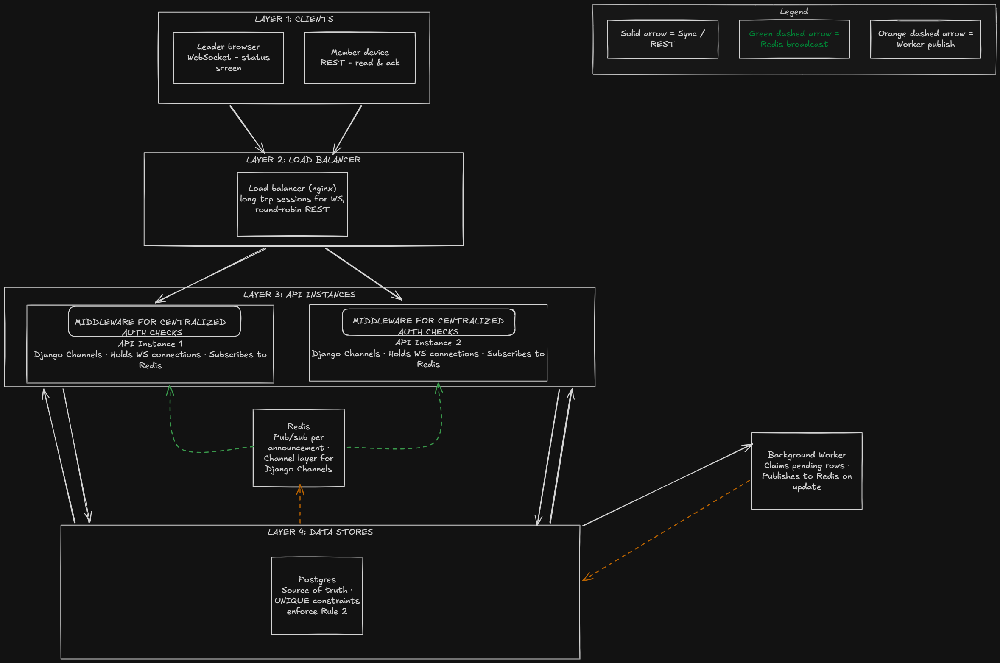

## PART 0 - REQUIREMENTS
### 1. WHAT I WILL BE BUILDING
My understanding is that, we need a proper **member-callout** system for local leadership to send important callouts to the right members and easily see who has received, read, and acknowledged them. Each local’s information will remain private, and the system will make sure members don’t receive the same callout twice. I’ll also include AI assistance to help leaders turn messy or ambiguous announcements into a clear message before they approve and send it.

### 2. ASSUMPTIONS
Following are some major assumptions that i would consider when designing this system:
- This system mainly incorporates 2 roles i.e: Leadership and Members. And data accessibility authority is imposed as per the role.
- Members and Leaders can only view information relevant to their own local.
- Only Active members of the selected local receives their respective call out.
- Members should not receive same callout notification twice.
- The leader needs to know how many members have responded to the callout, rather than having a full attendance tracking system.
- Members must receive the callout notification in advance of the scheduled meeting time ( given that their mobile is connected ).
- AI generated content will process further only upon leader's approval.
- Every member belongs to one local only.

### 3. POINT OF CONCERN

Some of the major areas of concern that i noticed:
-  Members must only access data from their own local.
- Suspended and retired members must lose access of their local immediately.

### 4. QUESTIONS TO BE ASKED FROM DENISE

- Should callouts target all active members of a local, or should leadership be able to target specific classifications, locations and shifts?

(Assumption: All active members of that specific local by default)
- What information may members see about one another?

(Assumption: Members can view only the email addresses of members within their own local. )
- What does “Sent” mean? queued for delivery, delivered to the member, or read by the member?

(Assumption: “Sent” means the announcement has been accepted and queued for background delivery to the selected recipients; it does not mean it was delivered, opened or acknowledged.)

## PART A - THE DESIGN
### 1. DATA MODEL

The model is built around one core idea: **union membership is the access boundary**. Every user belongs to one local, and `local_id` is used to control what data they can access. A user row represents the member, with `role` distinguishing leaders from members. Announcements belong to a local, and each send creates one `announcement_recipients` row per member to track delivery, reads, and acknowledgements. For Rule 2, `idempotency_key` prevents duplicate announcements, while `UNIQUE(announcement_id, member_id)` prevents the same member from being added twice if a send is retried.

---

#### `locals`

| Column | Type | Notes |
|---|---|---|
| `id` | UUID PK | |
| `name` | VARCHAR | e.g. "Local 27" |
| `created_at` | TIMESTAMP | |

---

#### `users`

| Column | Type | Notes |
|---|---|---|
| `id` | UUID PK | |
| `local_id` | UUID FK → locals.id | |
| `full_name` | VARCHAR | |
| `email` | VARCHAR UNIQUE | |
| `password_hash` | TEXT | bcrypt, salt included in output |
| `role` | ENUM | `leader` / `member` |
| `classification` | VARCHAR NULL | null for leaders |
| `status` | ENUM | `active` / `retired` / `suspended` |
| `created_at` | TIMESTAMP | |

---

#### `announcements`

| Column | Type | Notes |
|---|---|---|
| `id` | UUID PK | |
| `idempotency_key` | UUID UNIQUE | generated by client on form load; prevents double-send |
| `title` | VARCHAR | |
| `body` | TEXT | |
| `push_preview` | VARCHAR | AI-generated output |
| `needs_ack` | BOOLEAN | |
| `created_by` | UUID FK → users.id | |
| `local_id` | UUID FK → locals.id | |
| `sent_at` | TIMESTAMP NULL |represent when the announcement enters the sending/queued process |
| `created_at` | TIMESTAMP | |

---

#### `announcement_recipients`

| Column | Type | Notes |
|---|---|---|
| `id` | UUID PK | |
| `announcement_id` | UUID FK → announcements.id | |
| `member_id` | UUID FK → users.id | |
| `delivery_status` | ENUM | `pending` / `delivered` / `failed` |
| `read_at` | TIMESTAMP NULL | set when member reads |
| `acknowledged_at` | TIMESTAMP NULL | set when member acks and needs_ack field is true in announcements table |
| `rsvp` | ENUM NULL | `coming` / `cant_come` / null = no response |
| `created_at` | TIMESTAMP | |

**Constraint:** `UNIQUE (announcement_id, member_id)`  makes it impossible to deliver the same announcement to the same member twice, even on retry or restart.

### 2. THE SEND PATH

When a leader presses **Send** at 14:02, the API authenticates the leader, verifies their local, creates the announcement, and creates one `announcement_recipients` row for each active member. These rows start as `pending`, with the unique constraint preventing duplicates if the request is retried.

Once this database work completes, the API marks the announcement as queued and responds to the UI. Leadership does not wait for all 22,400 notifications to be delivered.

Delivery happens in the background. Workers across backend instances claim pending rows from Postgres and process them concurrently, with Postgres acting as the shared source of truth.

For the status screen, the UI should not query the database every second. The backend can periodically aggregate the recipient statuses and push updated counts using WebSockets or Server-Sent Events, so multiple users can watch progress without constantly hitting the database.

### 3. THE TWO RULES, BY DESIGN

**Rule 1:** Every request is checked against the user's `local_id` and `role`. Members and leaders can only access their own local's data, and members cannot perform leadership actions. Suspended or retired members lose access immediately. These checks should be handled centrally so a new endpoint cannot accidentally skip them.

**Rule 2:** Postgres is the shared source of truth for all backend instances. Workers atomically claim pending recipients, while `UNIQUE(announcement_id, member_id)` prevents duplicate recipient records during retries. A claim/lease allows failed work to be retried after a restart, and an idempotency key prevents duplicate notification delivery.

Also, regarding finding the points of failure in production , we can use structured logs and monitoring to track who accessed what and each delivery attempt. Alert on any successful cross-local/role access or more than one successful delivery for the same (announcement_id, member_id). Periodic checks can also verify these rules independently and catch violations that monitoring might miss.

### 4. A DIAGRAM

